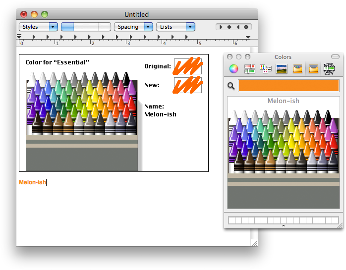

# Classic Crayons

Mac OS Classic's crayon color picker but for Mac OS X.

I know Mac OS X has a crayon picker already (now called "Pencils"),
but I've always found it rather disappointing. I've always thought
the Mac OS Classic crayon picker had a much better set of colors.

So here it is, back in all its glory.

Built on 10.6.8, tested on 10.6.8 (Snow Leopard) and 10.14.6 (Mojave).

